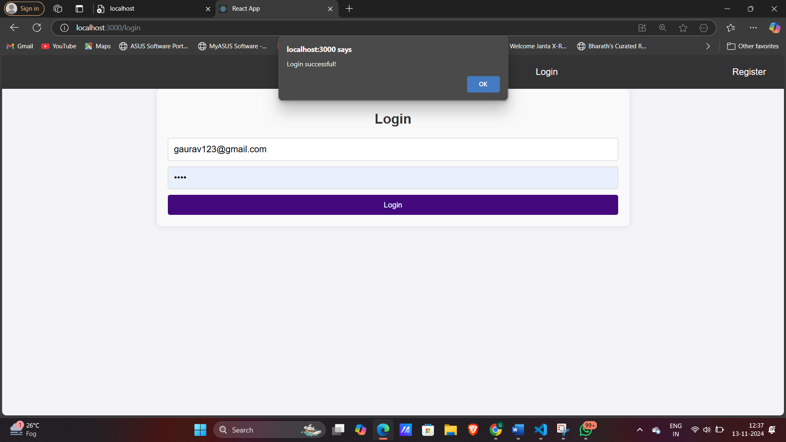

# Conference Management System

A Conference Management System (CMS) built using the MERN stack (MongoDB, Express, React, Node.js) with role-based access control. This CMS allows Admins, Managers, and Attendees to interact with the system based on assigned roles, enabling functionalities like conference management, seat reservations, and secure user access.

## Table of Contents
- [Features](#features)
- [Project Structure](#project-structure)
- [Installation](#installation)
- [Environment Variables](#environment-variables)
- [Usage](#usage)
- [Screenshots](#screenshots)
- [Technologies Used](#technologies-used)
- [Future Enhancements](#future-enhancements)

## Features
- **Role-Based Access Control (RBAC):** Defines access based on user roles - Admin, Manager, and Attendee.
- **User Authentication:** Secure login and registration with hashed passwords and JWT-based authentication.
- **Conference Management:** Allows admins and managers to create, view, and manage conferences.
- **Seat Reservation:** Enables attendees to reserve seats for conferences based on availability.
- **Responsive Design:** User-friendly design compatible with both desktop and mobile devices.

## Project Structure
```
Conference-Management-System/
├── backend/
│   ├── models/
│   ├── routes/
│   ├── middleware/
│   └── index.js
└── frontend/
    └── src/
        ├── components/
        ├── pages/
        ├── App.js
        └── index.js
```

## Installation

### Prerequisites
- Node.js and npm installed on your system.
- MongoDB setup (using MongoDB Atlas or a local instance).

### Setup Instructions

#### Clone the Repository
```bash
git clone https://github.com/your-username/conference-management-system.git
cd conference-management-system
```

#### Backend Setup
Navigate to the backend directory, install dependencies, and start the server.
```bash
cd backend
npm install
```

### Environment Variables
Create a `.env` file in the backend directory with the following environment variables:
```
PORT=5000
MONGO_URI=your_mongodb_connection_string
JWT_SECRET=your_jwt_secret
```

#### Start the Backend Server
```bash
npm start
```

#### Frontend Setup
Navigate to the frontend directory, install dependencies, and start the React development server.
```bash
cd ../frontend
npm install
npm start
```

### Access the Application
Open your browser and go to `http://localhost:3000`.

## Environment Variables
- **PORT:** The port on which the backend server runs.
- **MONGO_URI:** MongoDB connection string (use MongoDB Atlas or local MongoDB instance).
- **JWT_SECRET:** Secret key for JWT authentication.

## Usage

### Register and Login
Users can register and log in based on roles - Admin, Manager, or Attendee.

### Role-Based Dashboard
- **Admin:** Full access to manage users, conferences, and roles.
- **Manager:** Access to create and manage conferences.
- **Attendee:** Access to view conferences and reserve seats.

### Reserve Seats
Attendees can view conference details and reserve seats based on seat availability.

## Screenshots

### Register Page


### Login Page


### Admin Dashboard


### Add Conferences


### Delete details with reservation


## Technologies Used
- **Frontend:** React, Axios, React Router DOM
- **Backend:** Node.js, Express, MongoDB, Mongoose
- **Authentication:** JWT, bcrypt
- **Styling:** CSS
- **Version Control:** Git and GitHub


This README provides an overview of the Conference Management System project, including setup instructions, usage, and future enhancement plans. Let me know if you need further customization or more sections!